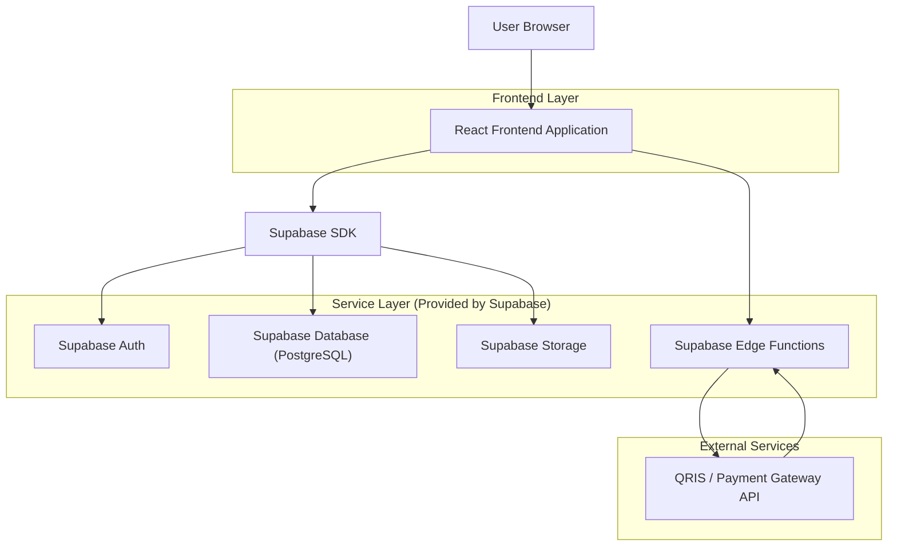
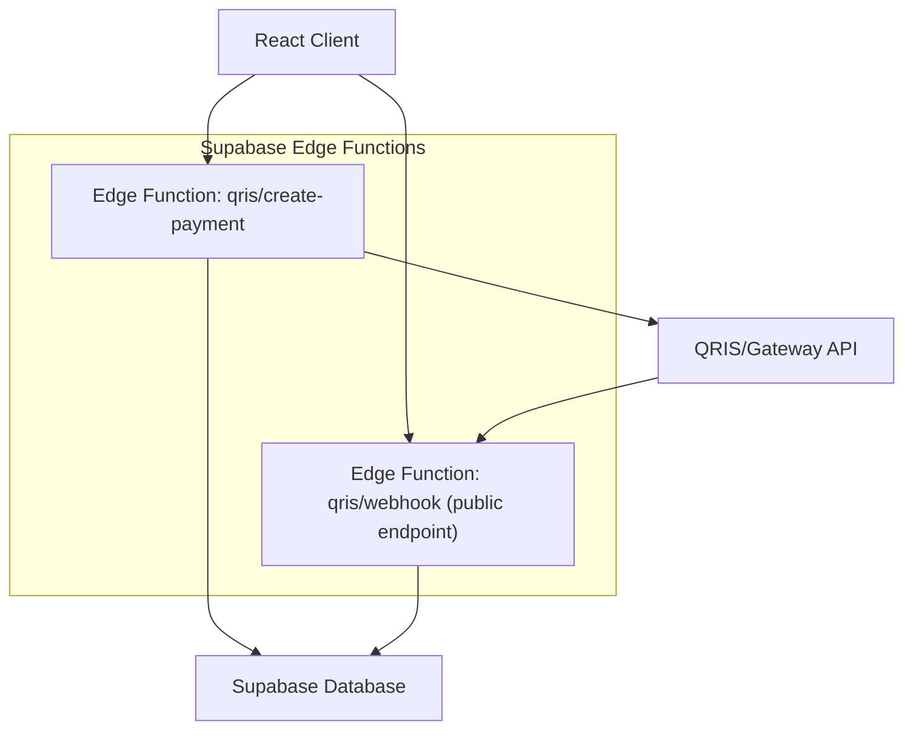
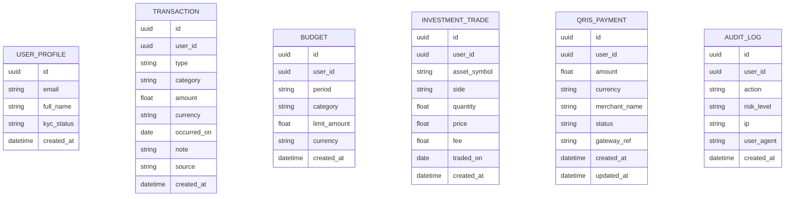

## 1.Architecture design


## 2.Technology Description
- Frontend: React@18 + tailwindcss@3 + vite
- Backend: Supabase (Auth + PostgreSQL + Storage + Edge Functions)

## 3.Route definitions
| Route | Purpose |
|-------|---------|
| /login | Masuk, daftar, reset sandi, verifikasi kontak |
| /dashboard | Ringkasan transaksi, anggaran, investasi, pintasan QRIS |
| /transactions | CRUD transaksi, impor, filter |
| /budgets | Setup anggaran, monitoring |
| /investments | Catat transaksi investasi, ringkasan portofolio |
| /qris | Scan/generate QR, konfirmasi, riwayat |
| /account | Profil, keamanan (2FA/sesi), audit aktivitas, consent |
| /admin/compliance | Monitoring audit log & ekspor (role internal) |

## 4.API definitions (If it includes backend services)
### 4.1 Edge Functions (server-side)
1) Inisiasi pembayaran QRIS
```
POST /functions/v1/qris/create-payment
```
Request
| Param Name| Param Type | isRequired | Description |
|---|---|---:|---|
| amount | number | true | Nominal pembayaran |
| currency | string | false | Default IDR |
| merchant_qr_payload | string | true | Payload QR merchant (hasil scan) |
| note | string | false | Catatan |
Response
| Param Name| Param Type | Description |
|---|---|---|
| payment_id | string | ID pembayaran internal |
| status | "pending" | Status awal |

2) Webhook status pembayaran dari gateway
```
POST /functions/v1/qris/webhook
```
Request (contoh)
| Param Name| Param Type | isRequired | Description |
|---|---|---:|---|
| gateway_event_id | string | true | ID event dari gateway |
| payment_id | string | true | ID pembayaran internal |
| status | string | true | sukses/gagal/pending |
| signature | string | true | Tanda tangan untuk verifikasi |

Catatan keamanan
- Simpan API key gateway & secret verifikasi webhook sebagai environment secret Edge Functions.
- Validasi signature dan idempotensi (gateway_event_id) sebelum update status.

## 5.Server architecture diagram (If it includes backend services)


## 6.Data model(if applicable)

### 6.1 Data model definition


### 6.2 Data Definition Language
User Profile (user_profiles)
```
CREATE TABLE user_profiles (
  id UUID PRIMARY KEY,
  email VARCHAR(255) UNIQUE NOT NULL,
  full_name VARCHAR(120),
  kyc_status VARCHAR(30) DEFAULT 'unverified',
  created_at TIMESTAMPTZ DEFAULT NOW()
);

GRANT SELECT ON user_profiles TO anon;
GRANT ALL PRIVILEGES ON user_profiles TO authenticated;
```

Transactions (transactions)
```
CREATE TABLE transactions (
  id UUID PRIMARY KEY DEFAULT gen_random_uuid(),
  user_id UUID NOT NULL,
  type VARCHAR(20) NOT NULL, -- income|expense|transfer
  category VARCHAR(60) NOT NULL,
  amount NUMERIC(18,2) NOT NULL,
  currency VARCHAR(10) DEFAULT 'IDR',
  occurred_on DATE NOT NULL,
  note TEXT,
  source VARCHAR(20) DEFAULT 'manual',
  created_at TIMESTAMPTZ DEFAULT NOW()
);

CREATE INDEX idx_transactions_user_date ON transactions(user_id, occurred_on DESC);

GRANT SELECT ON transactions TO anon;
GRANT ALL PRIVILEGES ON transactions TO authenticated;
```

Budgets (budgets)
```
CREATE TABLE budgets (
  id UUID PRIMARY KEY DEFAULT gen_random_uuid(),
  user_id UUID NOT NULL,
  period VARCHAR(20) NOT NULL, -- 2026-05
  category VARCHAR(60) NOT NULL,
  limit_amount NUMERIC(18,2) NOT NULL,
  currency VARCHAR(10) DEFAULT 'IDR',
  created_at TIMESTAMPTZ DEFAULT NOW()
);

CREATE INDEX idx_budgets_user_period ON budgets(user_id, period);

GRANT SELECT ON budgets TO anon;
GRANT ALL PRIVILEGES ON budgets TO authenticated;
```

Investment Trades (investment_trades)
```
CREATE TABLE investment_trades (
  id UUID PRIMARY KEY DEFAULT gen_random_uuid(),
  user_id UUID NOT NULL,
  asset_symbol VARCHAR(30) NOT NULL,
  side VARCHAR(10) NOT NULL, -- buy|sell
  quantity NUMERIC(18,8) NOT NULL,
  price NUMERIC(18,2) NOT NULL,
  fee NUMERIC(18,2) DEFAULT 0,
  traded_on DATE NOT NULL,
  created_at TIMESTAMPTZ DEFAULT NOW()
);

CREATE INDEX idx_investments_user_date ON investment_trades(user_id, traded_on DESC);

GRANT SELECT ON investment_trades TO anon;
GRANT ALL PRIVILEGES ON investment_trades TO authenticated;
```

QRIS Payments (qris_payments)
```
CREATE TABLE qris_payments (
  id UUID PRIMARY KEY DEFAULT gen_random_uuid(),
  user_id UUID NOT NULL,
  amount NUMERIC(18,2) NOT NULL,
  currency VARCHAR(10) DEFAULT 'IDR',
  merchant_name VARCHAR(120),
  status VARCHAR(20) DEFAULT 'pending',
  gateway_ref VARCHAR(120),
  created_at TIMESTAMPTZ DEFAULT NOW(),
  updated_at TIMESTAMPTZ DEFAULT NOW()
);

CREATE INDEX idx_qris_user_created ON qris_payments(user_id, created_at DESC);

GRANT SELECT ON qris_payments TO anon;
GRANT ALL PRIVILEGES ON qris_payments TO authenticated;
```

Audit Logs (audit_logs)
```
CREATE TABLE audit_logs (
  id UUID PRIMARY KEY DEFAULT gen_random_uuid(),
  user_id UUID,
  action VARCHAR(80) NOT NULL,
  risk_level VARCHAR(10) DEFAULT 'low',
  ip VARCHAR(64),
  user_agent TEXT,
  created_at TIMESTAMPTZ DEFAULT NOW()
);

CREATE INDEX idx_audit_user_created ON audit_logs(user_id, created_at DESC);

GRANT SELECT ON audit_logs TO anon;
GRANT ALL PRIVILEGES ON audit_logs TO authenticated;
```

Kebijakan RLS (ringkas)
- Aktifkan RLS untuk tabel ber-data pengguna, dan batasi akses baris ke `auth.uid() = user_id`.
- Admin compliance memakai role internal (claim) untuk akses audit lintas pengguna.

Catatan compliance (ringkas)
- OJK/BI: jejak audit aktivitas kritikal, kontrol akses berbasis peran, retensi log, dan pelaporan insiden.
- PCI: jangan simpan data kartu sensitif; untuk pembayaran gunakan token/reference dari gateway; enkripsi data sensitif at-rest & in-transit.
