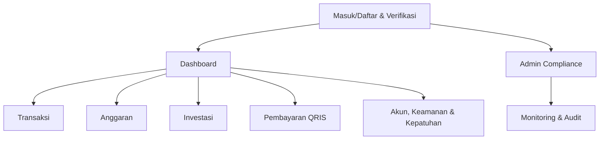

## 1. Product Overview
Aplikasi keuangan digital untuk mencatat transaksi, mengelola anggaran, memantau investasi, dan melakukan pembayaran QRIS.
Fokus pada keamanan serta kontrol compliance (OJK/BI/PCI) melalui audit, kontrol akses, dan jejak aktivitas.

**Ruang lingkup MVP v1**: pencatatan transaksi (manual + impor), anggaran dasar, portofolio investasi sederhana, QRIS bayar (generate/scan), keamanan akun, audit log, dan kontrol kepatuhan minimum.
**Ekstensi jangka panjang**: open banking, rekonsiliasi otomatis, insight/forecasting, produk kredit, wealth management lanjutan, merchant tools, antifraud real-time.

## 2. Core Features

### 2.1 User Roles
| Role | Registration Method | Core Permissions |
|------|---------------------|------------------|
| Pengguna | Email/nomor HP + verifikasi | Kelola transaksi, anggaran, investasi, QRIS, pengaturan keamanan |
| Admin Compliance (internal) | Akun internal | Akses audit log terpusat, pemantauan anomali, pengaturan kebijakan |

### 2.2 Feature Module
Kebutuhan aplikasi terdiri dari halaman utama berikut:
1. **Masuk/Daftar & Verifikasi**: login, registrasi, reset, verifikasi kontak, KYC ringan (opsional MVP).
2. **Dashboard**: ringkasan saldo/kas, tren pengeluaran, status anggaran, ringkasan portofolio, pintasan QRIS.
3. **Transaksi**: input/edit transaksi, kategorisasi, impor mutasi (file), pencarian & filter.
4. **Anggaran**: set anggaran per kategori/periode, progress, notifikasi threshold.
5. **Investasi**: catat pembelian/penjualan, nilai portofolio, performa sederhana.
6. **Pembayaran QRIS**: scan/generate QR, konfirmasi, riwayat pembayaran, status (pending/sukses/gagal).
7. **Akun, Keamanan & Kepatuhan**: profil, perangkat/sesi, 2FA, manajemen consent, audit aktivitas pengguna, dokumen/kebijakan.

### 2.3 Page Details
| Page Name | Module Name | Feature description |
|-----------|-------------|---------------------|
| Masuk/Daftar & Verifikasi | Autentikasi | Masuk/daftar, verifikasi email/HP, reset kata sandi |
| Masuk/Daftar & Verifikasi | KYC ringan (opsional MVP) | Kumpulkan data dasar identitas dan status verifikasi |
| Dashboard | Ringkasan keuangan | Tampilkan ringkasan transaksi terbaru, total pemasukan/pengeluaran, highlight anomali sederhana |
| Dashboard | Ringkasan anggaran & investasi | Tampilkan progres anggaran dan nilai portofolio ringkas |
| Dashboard | Pintasan QRIS | Akses cepat ke scan/generate QR dan status pembayaran terakhir |
| Transaksi | CRUD transaksi | Tambah/ubah/hapus transaksi, tipe (masuk/keluar/transfer), lampiran bukti (opsional) |
| Transaksi | Kategori & aturan | Pilih kategori, catat catatan, dukung aturan sederhana (mis. merchant → kategori) |
| Transaksi | Impor & rekonsiliasi ringan | Impor CSV/OFX sederhana, deteksi duplikat dasar, tandai "perlu review" |
| Anggaran | Setup anggaran | Buat anggaran per kategori & periode, set batas dan ambang peringatan |
| Anggaran | Monitoring | Lihat progres, sisa anggaran, dan histori periode |
| Investasi | Pencatatan transaksi investasi | Catat beli/jual, biaya, jumlah unit, harga, dan tanggal |
| Investasi | Nilai portofolio | Hitung nilai rata-rata dan performa sederhana berdasarkan input pengguna |
| Pembayaran QRIS | Inisiasi pembayaran | Scan QR atau generate QR, tampilkan detail merchant/nominal, minta konfirmasi |
| Pembayaran QRIS | Status & riwayat | Simpan status (pending/sukses/gagal), tampilkan detail transaksi dan bukti |
| Akun, Keamanan & Kepatuhan | Keamanan akun | Ubah sandi, aktifkan 2FA, kelola sesi/perangkat, batas percobaan login |
| Akun, Keamanan & Kepatuhan | Privacy & consent | Kelola persetujuan pemrosesan data, unduh ringkasan data akun |
| Akun, Keamanan & Kepatuhan | Audit & compliance | Tampilkan log aktivitas penting, policy center, dan pelaporan insiden sederhana |
| Admin Compliance | Monitoring & audit | Cari/filter audit log, lihat ringkasan kejadian, ekspor laporan |

## 3. Core Process
**Flow Pengguna**
1) Daftar/masuk → verifikasi kontak → (opsional) lengkapi KYC ringan.
2) Di Dashboard, lihat ringkasan dan pintasan.
3) Catat transaksi manual atau impor file mutasi → kategorisasi → data masuk ke perhitungan anggaran.
4) Buat anggaran per kategori → pantau progres → terima peringatan saat mendekati/melewati batas.
5) Catat aktivitas investasi → lihat nilai portofolio ringkas.
6) QRIS: scan/generate → konfirmasi nominal & merchant → sistem memproses → status sukses/gagal muncul di riwayat.
7) Kelola keamanan (2FA, sesi) dan lihat audit aktivitas di halaman Akun.

**Flow Admin Compliance**
1) Masuk ke Admin → pantau audit log → telusuri event berisiko (login gagal berulang, perubahan 2FA, pembayaran QRIS gagal) → ekspor laporan.

